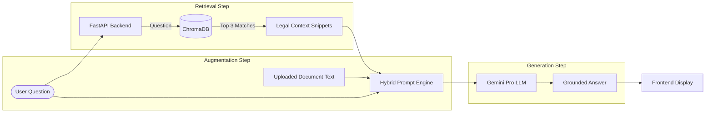
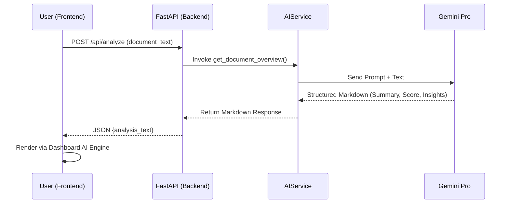

# LawGeeks-Pro System Architecture ⚖️
**Demystifying Legal Jargon with AI-Powered Retrieval Augmented Generation (RAG)**

## 🎯 Executive Overview
LawGeeks-Pro is a high-performance, AI-native platform designed to bridge the accessibility gap in legal documentation. It utilizes a three-tier decoupled architecture to provide legally grounded, context-aware analysis of complex contracts.

---

## 🏗️ System Architecture Topology

### 1. Presentation Layer (Frontend)
- **Technology**: Vanilla HTML5, TailwindCSS, JavaScript (ES6+).
- **Core Components**:
    - **Dynamic Analysis Module**: Asynchronous markdown rendering with real-time UI transitions.
    - **Intelligent Chat Interface**: State-managed RAG interaction engine for document specific Q&A.
    - **Export Engine**: Client-side PDF generation for professional summary reports.

### 2. Orchestration Layer (Backend)
- **Framework**: **FastAPI** (Python 3.10+) utilizing asynchronous I/O.
- **Operational Roles**:
    - **Analysis Routing**: Directs data to the Gemini Reasoning Engine.
    - **RAG Orchestration**: Coordinates the interplay between user queries, document context, and the legal knowledge base.
    - **Static Middleware**: High-speed delivery of UI assets and dashboard components.

### 3. Intelligence Tier (AI & Knowledge Store)
- **Reasoning Model**: **Google Gemini Pro** (`gemini-pro-latest`) for advanced document logic.
- **Semantic Layer**: **Google Embedding-001** for high-dimensional text vectorization.
- **Knowledge Store**: **ChromaDB** – A high-performance, local persistent vector database.

---

## 🔄 Technical Workflows

### A. The RAG Q&A Workflow (Deep Reasoning)
The core of the system, merging real-time user document context with pre-indexed legal precedents.

### B. Document Analysis Pipeline
The flow for generating structural summaries and the dynamic "Vigilance Score".

---

## 🛠️ Strategic Tech Stack
| Category | Technology | Rationale |
| :--- | :--- | :--- |
| **Backend** | Python & FastAPI | Concurrent execution and seamless AI library support. |
| **LLM Engine** | Google Gemini | High-fidelity reasoning and long-context window processing. |
| **Vector DB** | ChromaDB | Efficient semantic storage and local deployment capability. |
| **Orchestration** | LangChain | Standardized interface for AI chains and RAG retrieval. |
| **UI/UX** | Tailwind CSS | Modern, responsive, and performance-optimized styling. |

---

## 🛡️ Security & Privacy
1. **Data Sovereignty**: Vectorized knowledge remains in the local `vector_db` directory.
2. **Stateless Logic**: User-uploaded documents are processed in-memory and are not persistently stored.
3. **Pydantic Validation**: Strict schema enforcement for all data moving between tiers.

---
*Created for the LawGeeks-Pro Development Repository.*
