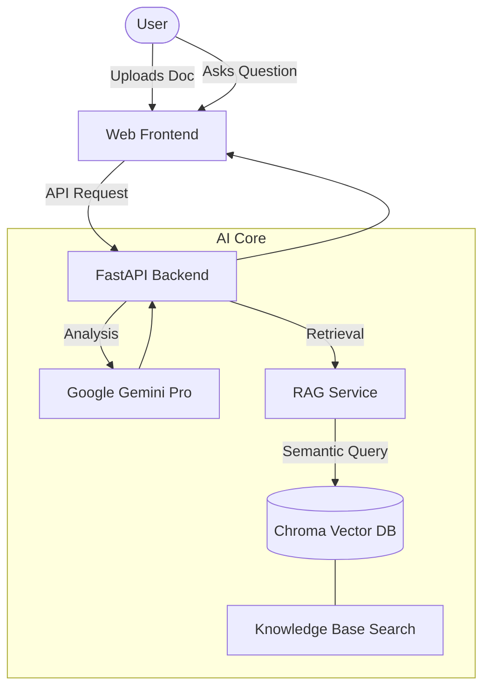

# LawGeeks-Pro ⚖️
> **Demystifying Legal Jargon with AI-Powered Intelligence**

[](https://fastapi.tiangolo.com/)
[](https://ai.google.dev/)
[](https://www.langchain.com/)
[](https://www.trychroma.com/)

An intelligent paralegal assistant that simplifies complex legal documents using **Retrieval-Augmented Generation (RAG)** and advanced document analysis. Built to bridge the gap between technical legal language and everyday understanding.

---

## 🚀 Key Features

-   **📄 Multi-Format Support**: Seamlessly analyze `.pdf`, `.docx`, images (`.png`, `.jpg`), or direct text input.
-   **🔍 Automated Insights**: Generates structured summaries, extracts critical dates, identifies financial terms, and highlights key clauses.
-   **🛡️ Vigilance Score**: A dynamic risk assessment (1–100) that flags unfair clauses and potential legal traps.
-   **💬 RAG-Powered Q&A**: Ask context-aware questions grounded in your document and a pre-loaded knowledge base of Indian Law.
-   **📊 Professional Reporting**: Export your analysis and insights into a clean, downloadable PDF report.
-   **🌐 Accessibility**: Integrated text-to-speech engine and translation support for major Indian languages.

---

## 🏗️ System Architecture & Workflow

LawGeeks-Pro utilizes a three-tier architecture combining a modern frontend, an asynchronous FastAPI backend, and a RAG (Retrieval-Augmented Generation) intelligence layer.

### Workflow Diagram (Simplified)


> **For a deep-dive into the technical implementation, please see our [Full System Architecture & Detailed Workflows](./SYSTEM_ARCHITECTURE.md) document.**

---

---

## 📂 File Structure

```text
LawGeeks-Pro/
├── api/                    # Backend API Logic
│   ├── core/               # AI & RAG service implementations
│   ├── models/             # Pydantic data schemas
│   └── index.py            # Main FastAPI application
├── knowledge_base/         # PDF source documents for Indian Law
├── public/                 # Web Frontend assets
│   ├── assets/             # Images and icons
│   ├── css/                # Tailwind & Custom styles
│   ├── js/                 # Logic for analysis & chat
│   └── home.html           # Landing page
├── scripts/                # Utility & Setup scripts
│   ├── ingest.py           # Vector database builder
│   └── .env                # Environment configurations
├── vector_db/              # Persisted ChromaDB data
├── config/                 # Static configurations
├── tests/                  # Unit and integration tests
├── requirements.txt        # Python dependencies
└── vercel.json             # Deployment configuration
```

---

## 💻 Technolgoy Stack

-   **Backend**: FastAPI, Uvicorn
-   **AI/LLM**: Google Gemini (`gemini-pro-latest`)
-   **RAG Framework**: LangChain, ChromaDB
-   **Embeddings**: Google Generative AI Embeddings
-   **Frontend**: HTML5, TailwindCSS, Vanilla JavaScript
-   **PDF/Docs**: `pypdf`, `python-docx`, `tesseract-ocr`

---

## 🏁 Getting Started

### 1. Prerequisites
-   Python 3.10+
-   Google Gemini API Key ([Get it here](https://aistudio.google.com/))

### 2. Installation
```bash
# Clone the repository
git clone https://github.com/SIBAM890/LawGeeks-Pro.git
cd LawGeeks-Pro

# Setup virtual environment
python -m venv .venv
source .venv/bin/activate  # Windows: .venv\Scripts\activate

# Install dependencies
pip install -r requirements.txt
```

### 3. Configuration
1.  Navigate to `scripts/` and create a `.env` file:
    ```env
    GOOGLE_API_KEY="your_api_key_here"
    ```
2.  Place your reference legal PDFs in the `knowledge_base/` folder.

### 4. Build Vector DB & Run
```bash
# Ingest the knowledge base
cd scripts
python ingest.py

# Start the server
cd ..
uvicorn api.index:app --reload
```

---

## ⚖️ Disclaimer
*LawGeeks-Pro provides informational analysis only and should not be considered legal advice. Always consult a licensed legal professional for official guidance.*

---
Proudly built for the **Generative AI for Demystifying Legal Documents** challenge.


