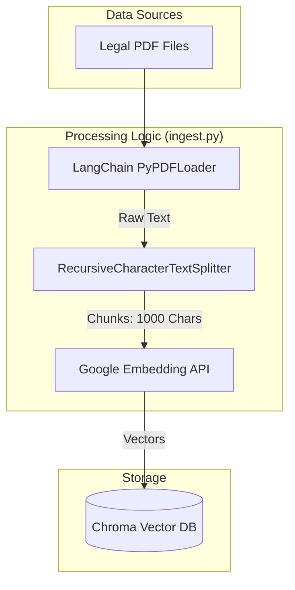
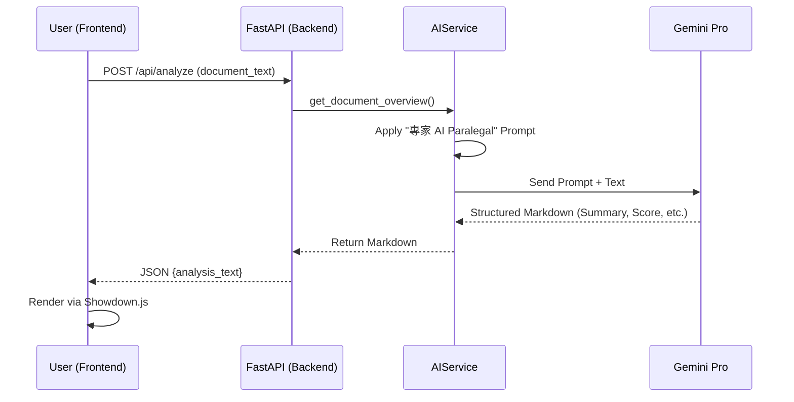
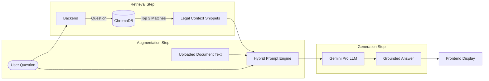

# LawGeeks-Pro System Architecture & Detailed Workflows

## 🛠️ Overview
LawGeeks-Pro is built on a modular, three-tier architecture designed for high-performance document reasoning and retrieval. It leverages the "Retrieval-Augmented Generation" (RAG) pattern to ensure AI responses are grounded in actual Indian law.

---

## 🏗️ System Architecture

### 1. Client Tier (Frontend)
- **Technology**: Vanilla HTML5, TailwindCSS, JavaScript (ES6).
- **Key Modules**:
    - `FileHandler`: Manages document uploads and OCR (Tesseract integration).
    - `AnalysisRenderer`: Dynamically renders Markdown generated by the AI.
    - `ChatUI`: An interactive interface for real-time RAG querying.
    - `ReportGenerator`: Client-side logic to export analysis as PDF.

### 2. Application Tier (Backend)
- **Framework**: FastAPI (Asynchronous Python).
- **Core Services**:
    - **AIService**: Handles basic document summarization and risk scoring. Uses static prompt templates and a direct chain to Gemini.
    - **RAGService**: The intelligence layer for Q&A. It orchestrates the retrieval of legal precedents and combines them with the specific document context.
- **Middleware**: CORS management and static file serving for the SPA interface.

### 3. Intelligence Tier (AI & Data)
- **LLM**: Google Gemini Pro (`gemini-pro-latest`) for advanced reasoning.
- **Embeddings**: Google `embedding-001` for semantic vectorization of text.
- **Vector Database**: **ChromaDB** – A local, persistent store used to hold indexed Indian legal documents (Knowledge Base).

---

## 🔄 Detailed Workflows

### A. The Document Ingestion Pipeline (Offline)
This workflow populates the "brain" of LawGeeks-Pro with legal knowledge.

### B. The Document Analysis Workflow
Triggered when a user uploads a new contract for overview.

### C. The RAG Q&A Workflow (Deep Reasoning)
The most complex part of the system, combining two distinct contexts.

---

## 📊 Data Mapping Table

| Component | Responsibility | Data Type |
| :--- | :--- | :--- |
| **public/home.html** | User Entry | UI State |
| **api.index** | Request Routing | JSON / Pydantic Models |
| **Core AI Logic** | Prompting | Markdown / String |
| **Vector DB** | Knowledge Retrieval | Float Vectors (Embeddings) |
| **scripts/.env** | Security & Auth | Environment Variables |

---

## 🔒 Security & Privacy
1. **Local Processing**: Vector data is stored on-disk, ensuring the knowledge base remains private.
2. **Stateless API**: Documents are processed in-memory and not stored on the server unless explicitly logged.
3. **Environment Security**: API keys are managed via `.env` and never hardcoded in the codebase.
